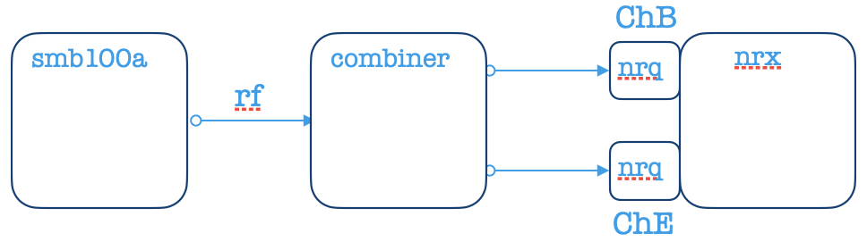
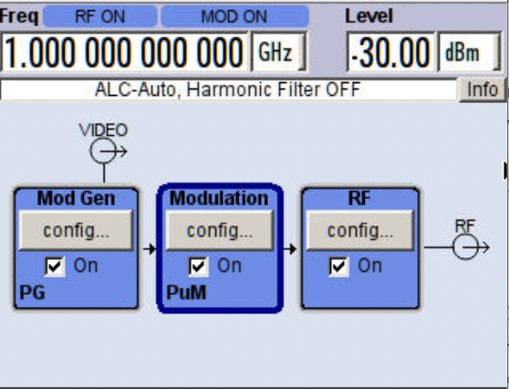
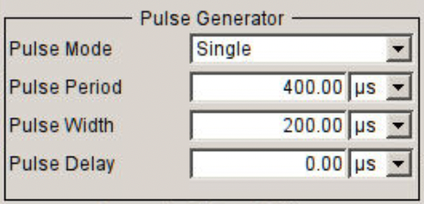
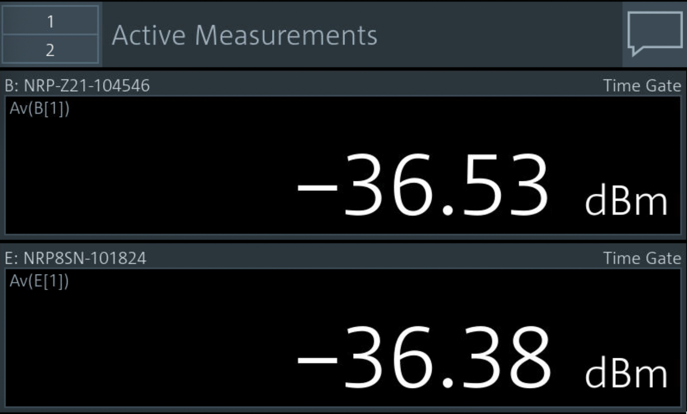
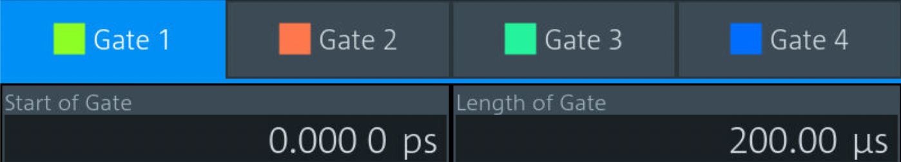
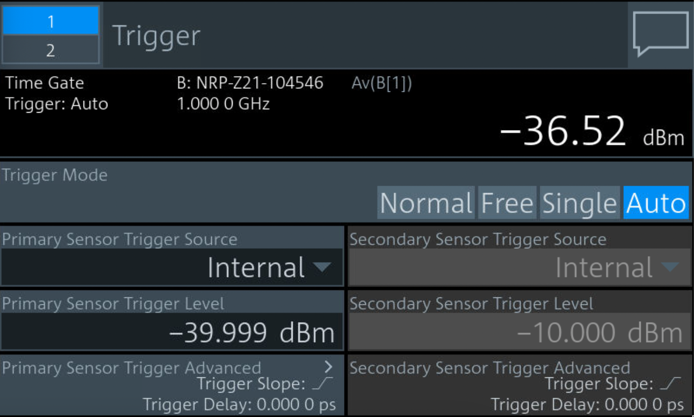
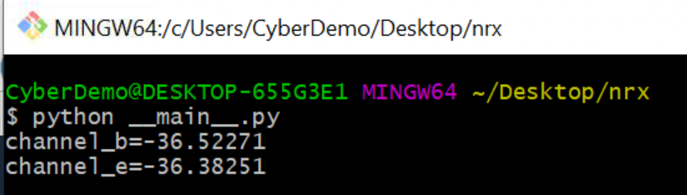

# NRX Multichannel Example

This example performs simultaneous Time Gate measurements on `Channel B` and `Channel E`, then prints the result.

## Equipment

-   R&S SMB100A Vector Signal Generator
-   R&S NRX Power Meter

## Connections

## SMB100A RF Output

Running `smb_setup.py` yields the following pulse-modulated RF setup:

## Measurement Settings

The following NRX settings are used.

### Display

There are two identical measurements.

### Time Gate Mode

The measurements use a `Time Gate` that corresponds to `RF High`.

### Trigger

## Results

I ran the script and measured the following:

